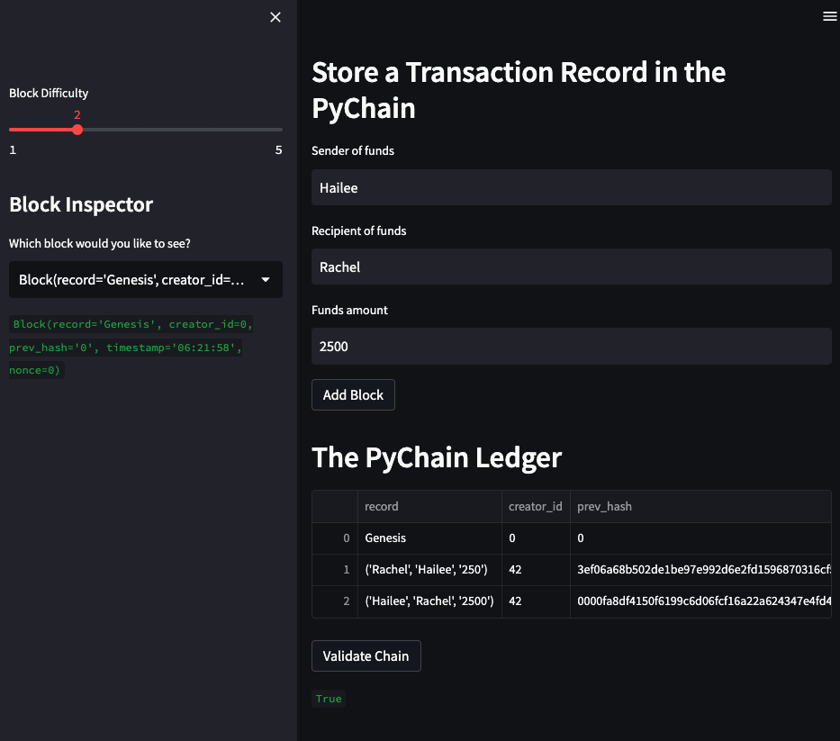

# Blockchain_PyChain_Ledger

This is a `.py` file to be opened in Visual Studio Code (VS Code). This file uses blockchain via PyChain in order to create a financial ledger. This file gathers sender, receiver, and amount information from a user for financial transactions and records them in the block using hashing.

---

## Technologies

This application was written in Python 3.9.12. This application is dependent on the following libraries:

* [streamlit](https://streamlit.io/)
* [dataclasses](https://docs.python.org/3/library/dataclasses.html)
* [typing](https://docs.python.org/3/library/typing.html)
* [datetime](https://docs.python.org/3/library/datetime.html)
* [pandas](https://pandas.pydata.org/)
* [hashlib](https://docs.python.org/3/library/hashlib.html)

---

## Installation Guide

Install [VS Code](https://code.visualstudio.com/) if you don't already have it.

If you have [Anaconda](https://www.anaconda.com/products/distribution) downloaded, then dataclasses, typing, datetime, pandas, and hashlib will be part of your package. You can check that they're ready to use by typing the following in your CLI terminal:

```python
conda list dataclasses
conda list typing
conda list datetime
conda list pandas
conda list hashlib
```

If you need to install streamlit:

```python
pip install streamlit
```

then you can check that these were installed by entering:

```python
conda list streamlit
```

---

## Usage

Clone this repository to your local machine. Use your terminal (MacOS) or gitbash (Windows) to open the file. Type `streamlit run pychain.py` and hit ENTER.

Streamlit will then open the file in your default internet browser. You can enter your information and it will be recorded in the block.

See a sample screenshot below:



---

## Contributors

[Rachel Ann Hodson](https://www.linkedin.com/in/rachelannhodson/)
rachelannhodson@gmail.com

---

## License

MIT